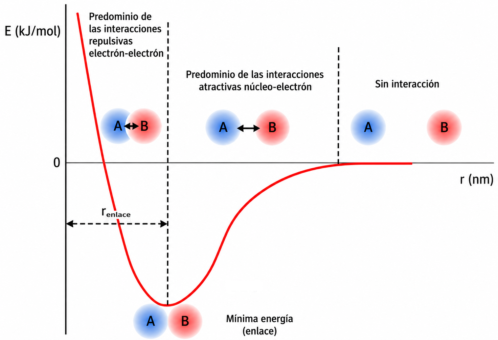
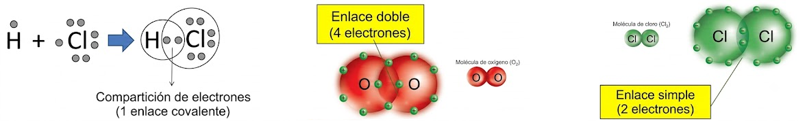
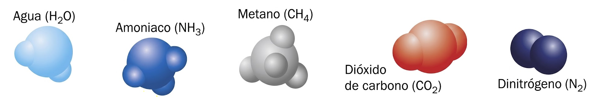
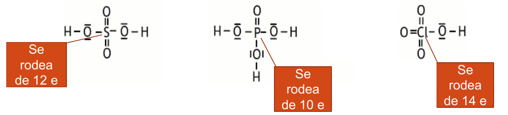
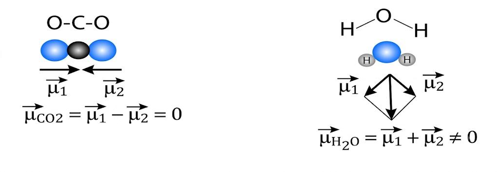
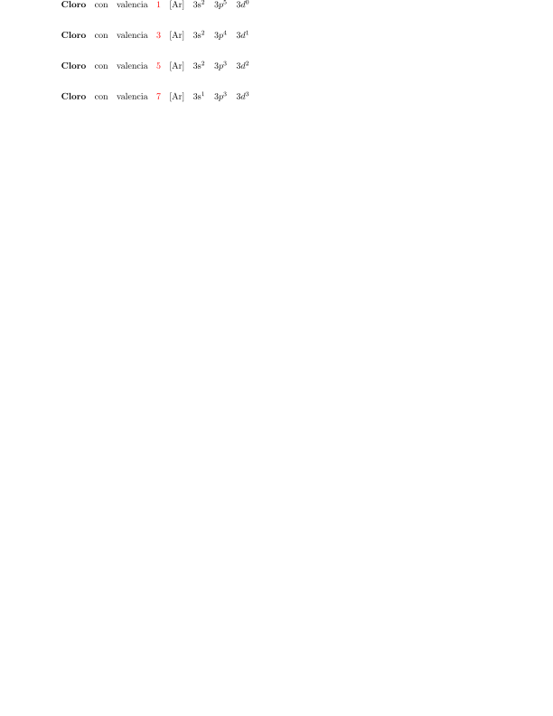
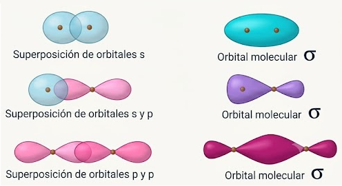
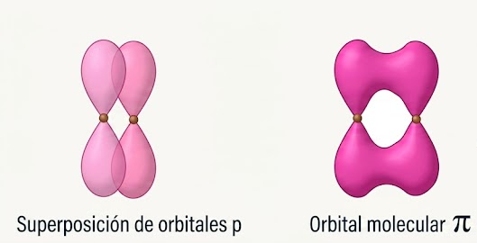

# Tema 2: Enlace químico

## **1. Introducción**

La causa determinante de que los átomos traten de combinarse unos con otros es la tendencia de todos ellos a adquirir la configuración de gas noble ($\ce{ns np^6}$) en su capa más externa o “capa de valencia”.

Ésta es una configuración especialmente estable a la que tienden todos los elementos. En consecuencia, y en función de la configuración de su capa de valencia, tendrán lugar distintos tipos de procesos (transferencia de electrones, compartición...) que darán lugar a los distintos tipos de enlace químico.

El estudio de las variaciones de energía que tienen lugar cuando dos especies químicas (átomos neutros, iones...) se aproximan desde una distancia grande, donde suponemos que no existe ningún tipo de interacción electrostática (atracciones o repulsiones) entre sus núcleos y electrones, nos aporta una valiosa información sobre el enlace.

En la gráfica se observa como a medida que se acercan A y B las interacciones atractivas entre los núcleos y electrones son predominantes. **La energía del sistema disminuye, ganando en estabilidad**, y tienden a acercarse uno a otro, pero a partir de determinada distancia las interacciones repulsivas entre los electrones (también entre los núcleos) se vuelven más importantes, con lo cual se produce una aumento de la energía del sistema, lo que le hace perder estabilidad y tienden a separarse.

El mínimo de energía se corresponderá, por tanto, con la agrupación más estable entre A y B. Se dice entonces que existe enlace entre A y B. La distancia correspondiente se denomina **distancia de enlace**.

{ style="display: block; margin: 0 auto; height: 450px; width: 100%;" }

## **2. Tipos de enlace químico**

**Enlace iónico**: Las **unidades estructurales básicas** enlazadas son iones de signo contrario (**aniones** y **cationes**). Los iones se mantienen unidos mediante fuerzas de naturaleza electrostática, debidas a la presencia de cargas de distinto signo.

**Enlace covalente**: Las **unidades estructurales básicas** enlazadas son **átomos**. Los átomos se mantienen unidos para poder compartir electrones de su capa de valencia.

**Enlace metálico**: Las **unidades estructurales básicas** enlazadas son **átomos con carga positiva** (modelo de "nube electrónica"). Los átomos se mantienen unidos mediante electrones deslocalizados que se sitúan entre los cationes.

**TIPOS DE SÓLIDOS**.

Básicamente podemos encontrar varios tipos de sólidos, según sea el enlace: sólidos **iónicos**, sólidos de red **covalente**, sólidos **metálicos** y sólidos **moleculares**.

**SÓLIDOS IÓNICOS**. 

Las **unidades estructurales básicas** de estos compuestos son **iones** (aniones y cationes) unidos mediante enlaces iónicos.

El **enlace iónico es muy fuerte**, razón por la que poseen **elevados puntos de fusión **y **ebullición**.

Ejemplos de sólidos iónicos son el cloruro de sodio (NaCl), la fluorita ($\ce{CaF2}$) o el óxido de titanio o rutilo ($\ce{TiO2}$)

{ style="display: block; margin: 0 auto; height: 250px; width: 45%;" }

**SÓLIDOS DE RED COVALENTE**

Las **unidades estructurales** son **átomos neutros que se unen entre si mediante enlaces covalentes** formando una estructura tridimensional o red. Los enlaces covalentes son muy fuertes (incluso más que los iónicos), razón por la que los compuestos de red covalente presentan una elevada dureza. Ejemplos de sólidos covalentes: diamante, silicatos, grafito...

**Diamante**

Red de átomos de carbono unidos mediante enlaces covalentes formando tetraedros que se repiten en el espacio formando una red covalente.

{ style="display: block; margin: 0 auto; height: 250px; width: 45%;" }

**Grafito**

Los carbonos se unen entre sí mediante tres enlaces covalentes formando hexágonos, que a su vez se distribuyen en capas que se mantienen débilmente unidas gracias a electrones que se sitúan entre ellas. Estos electrones se pueden mover con cierta facilidad lo que confiere al grafito propiedades conductoras.

La unión entre las láminas es muy débil, siendo por tanto muy fáciles de separar.

{ style="display: block; margin: 0 auto; height: 250px; width: 45%;" }

**SÓLIDOS METÁLICOS**

Las **unidades estructurales** son **iones positivos de metales** entre los que se sitúan electrones prácticamente libres formando una especie de "gas o nube electrónica".

Los **electrones libres** son los **responsables de las propiedades conductoras de los metales** y la fortaleza del enlace justifica asimismo los **puntos de fusión elevados**.

Los **metales** son **ejemplos típicos** de este tipo.

{ style="display: block; margin: 0 auto; height: 250px; width: 45%;" }

**SÓLIDOS MOLECULARES**

Las **unidades básicas** son **moléculas**, pero existen fuerzas entre ellas (intermoleculares) suficientes para unir (aunque débilmente) a las moléculas formando una estructura típica de sólidos.

La **debilidad de las fuerzas entre moléculas** condicionan que estas sustancias fundan (o sublimen) a **temperaturas bajas**.

Ejemplos de sólidos moleculares son el yodo o las parafinas.

El agua es sólida por debajo de 0 $^{\circ}$C a presión de 1 atm. Las uniones que se representan en la figura por líneas negras son puentes de hidrógeno entre las moléculas.

{ style="display: block; margin: 0 auto; height: 250px; width: 45%;" }

## **3. Enlace iónico**

Si enfrentamos un átomo al que le falten pocos electrones en su capa de valencia para adquirir la configuración de gas noble (muy electronegativo, tendencia a coger electrones), tal como el cloro, con otro cuya electronegatividad sea baja (tendencia a ceder electrones), tal como el sodio, éste cederá un electrón al cloro.

Como consecuencia, el cloro se convertirá en un ión negativo (anión) mientras que el sodio se convierte en un ión positivo (catión).

Ambos se unen debido a la atracción entre cargas de distinto signo (atracción electrostática).

En realidad este proceso se realiza simultáneamente en un número enorme de átomos con el resultado de que se formarán gran número de iones positivos y negativos que se atraen mutuamente formando una estructura de iones dispuestos en forma muy ordenada. Es lo que se conoce con el nombre de red iónica o cristal.

En los **compuestos iónicos no se puede hablar de moléculas individuales**, sino de grandes agregados. Por tanto, en los compuestos iónicos, la **fórmula no** podemos decir que **represente una molécula**. Solamente indica la proporción en la que los iones se encuentran combinados.

Ejemplos:

KCl. La relación de iones $\ce{K^+}$ e iones $\ce{Cl^-}$ es 1:1 (hay el mismo número de ambos).

$\ce{CaCl2}$. Hay doble número de iones $\ce{Cl^-}$ que de iones $\ce{Ca^{2+}}$

El número de iones de determinado signo que rodean a otro de signo contrario recibe el nombre de **índice de coordinación del ión** y depende del tamaño relativo de ambos.

Por ejemplo, el cloruro de sodio cristaliza con una estructura en la cual el ión sodio está rodeado de seis iones cloruro y éste de seis iones sodio. Se dice que el índice de coordinación (IC) es 6 (también, 6:6).

Los sólidos iónicos con índice de coordinación (IC) seis, dan lugar a la estructura denominada **cúbica centrada en las caras** (ver figura). Es la estructura de los cristales de NaCl.

{ style="display: block; margin: 0 auto; height: 250px; width: 55%;" }

Como se puede observar existe una gran diferencia de tamaño entre el anión cloruro ($\ce{Cl^-}$) y el catión sodio ($\ce{Na^+}$).

Los **compuestos tipo AB** suelen adquirir la estructura del NaCl, IC = 6, como hemos visto, o del CsCl, IC = 8.

Los sólidos iónicos con índice de coordinación (IC) ocho, dan lugar a la estructura denominada **cúbica centrada en el cuerpo** (ver figura). Es la estructura de los cristales de CsCl.

En esta ocasión los tamaños del anión y del catión son similares.

{ style="display: block; margin: 0 auto; height: 250px; width: 55%;" }

Los compuestos tipo $\ce{AB2}$ adoptan, generalmente, las estructuras del $\ce{TiO2}$ (rutilo) con IC = 6:3, o las del $\ce{CaF2}$ (fluorita) con IC = 8:4.

Es obvio que se necesita muy buena visión espacial para distinguir las celdillas unidad de estos cristales.

{ style="display: block; margin: 0 auto; height: 250px; width: 65%;" }

**FORMACIÓN DE SÓLIDOS IÓNICOS Y ENERGÍA**

Tomemos como ejemplo el NaCl. Si partimos de Na y Cl en sus estados normales, Na (s) y $\ce{Cl2}$ (g), para que se produzca la reacción global:

$\ce{\hspace{3cm} Na (s) + \dfrac {1}{2}  Cl2 (g) \; \rightarrow \; NaCl (s) \hspace{2cm} \Delta H_f < 0}$

Podemos considerar los siguientes procesos intermedios:

$\ce{Na (s) \; \rightarrow \; Na (g) , \Delta H_{sub} > 0}$, energía de sublimación del Na.

$\ce{Na (g) \; \rightarrow \; Na+ (g) + e^- , E{.}I{.} > 0}$, energía de ionización del sodio.

$\ce{\dfrac {1}{2} Cl2 (g) \; \rightarrow \; Cl (g) , \dfrac {1}{2} \Delta H_{dis} > 0}$, energía de disociación del cloro.

$\ce{Cl (g) + e^- \; \rightarrow \; Cl (g) , A{.}E{.} < 0}$, afinidad electrónica del cloro.

$\ce{Na^+ (g) + Cl^- (g) \; \rightarrow \; NaCl (s) , U_r < 0}$, energía reticular del NaCl.

La **energía reticular** es la **energía que se desprende al formarse un mol de cristal iónico a partir de sus componentes en estado gaseoso**.

Un **cristal iónico** será, por tanto **más estable** (más duro, menos soluble, de mayor punto de fusión...), cuanto **mayor** sea su **energía reticular**.

**CICLO DE BORN-HABER**

Una **forma de calcular la energía reticular**, $\ce{U_r}$ se puede hacer mediante un **balance energético**:

{ style="display: block; margin: 0 auto; height: 150px; width: 35%;" }

La suma de los procesos parciales coincide con el proceso de combinación químico directo, por ello podemos concluir que la suma de sus variaciones energéticas coincidirá con la de la reacción global:

$\ce{\Delta H_f = \Delta H_{sublimaci{ó}n} + EI + \dfrac {1}{2} \Delta H_{disociaci{ó}n} + AE + Ur}$ 

con lo que:

$\ce{Ur = \Delta H_f - \Delta H_{sub} - EI - \dfrac {1}{2} \Delta H_{dis} - AE}$

**ENERGÍA RETICULAR**

El **cálculo de la energía reticular** se puede hacer también a partir de la **ecuación de Born-Landé**:

$\ce{U = - \dfrac {K  \cdot z_1 \cdot z_2 \cdot e^2 \cdot N_A \cdot M }{d_0} \cdot \left(1 - \dfrac {1}{n} \right)}$
{ style="border: 2px solid #34077d; border-radius: 12px; padding: 15px; text-align: center; max-width: 500px; margin: 20px auto; display: block; background: #f9f7fb" }

Donde **K** es la constante de Coulomb en el vacío, $\boldsymbol{\ce{z_1}}$ y $\boldsymbol{\ce{z_2}}$ son las cargas de los iones, **e** es la carga del electrón, $\boldsymbol{\ce{N_A}}$ la constante de Avogadro, $\boldsymbol{\ce{d_0}}$ la distancia internuclear, **M** es la constante de Madelung, que depende del tipo de red cristalina, y **n** es el factor de compresibilidad.

En el fondo es la fórmula de la energía potencial eléctrica modificada, y lo que tenemos que tener muy claro es que U es mayor cuanto mayores son las cargas de los iones y cuanto menores son sus radios.

$\ce{U \propto \dfrac {z_1 \cdot z_2 }{d_0} }$
{ style="border: 2px solid #34077d; border-radius: 12px; padding: 15px; text-align: center; max-width: 150px; margin: 20px auto; display: block; background: #f9f7fb" }

**PROPIEDADES DE LOS COMPUESTOS IÓNICOS**

A **temperatura ambiente**, son **sólidos cristalinos** como revela su estructura muy ordenada y compacta.

Poseen **puntos de fusión y ebullición elevados**, ya que el enlace iónico es de una gran fortaleza, y para que el compuesto se convierta en líquido o en gas es necesario romper esos enlaces, para lo cual hay que suministrar una cantidad considerable de energía.

Son **duros**, ya que para rayar un sólido es necesario romper cierto número de enlaces y el enlace es muy fuerte.

Suelen ser **solubles en agua** y al disolverse se rompen en iones positivos y negativos (las sustancias que al romperse dan iones reciben el nombre de electrolitos).

En **estado sólido no conducen la electricidad**, ya que los iones están fuertemente unidos y no hay cargas libres que puedan circular.

**Fundidos o en disolución acuosa son buenos conductores de la corriente eléctrica** debido a la existencia de iones (átomos con carga) que se dirigen a los electrodos de polaridad contraria.

## **4. Enlace metálico**

**ENLACE METÁLICO (MODELO DE GAS ELECTRÓNICO)**

El modelo más sencillo de enlace metálico se basa en una de las propiedades características de los metales: su baja electronegatividad (ceden electrones con facilidad).

Así pues, el **enlace metálico** podemos describirlo como una **disposición muy ordenada y compacta de iones positivos del metal** (red metálica) **entre los cuales se distribuyen los electrones perdidos por cada átomo a modo de “nube electrónica”**.

Es importante observar que los electrones pueden circular libremente entre los cationes, no están ligados (sujetos) a lo núcleos y son compartidos por todos ellos (se dice que los electrones están **deslocalizados**)

Esta nube electrónica hace de “colchón” entre las cargas positivas impidiendo que se repelan, a la vez que mantienen unidos los átomos del metal.

{ style="display: block; margin: 0 auto; height: 250px; width: 55%;" }

**ENLACE METÁLICO (TEORÍA DE BANDAS)**

El modelo de la **teoría de bandas**, supone que, al estar tan cerca los átomos de los metales unos de otros, sus orbitales de valencia se superponen entre sí, dando lugar a un conjunto de orbitales muy parecidos que constituyen lo que se llama “**banda de niveles energéticos**”.

La **banda de valencia** está formada por los orbitales atómicos de valencia.

La **banda de conducción** está formada por los primeros orbitales atómicos vacíos.

En los metales ambas bandas se solapan o están muy próximas y la energía que hay que aportar para que un electrón pase de una a otra es mínima.

En los **aislantes** dichas bandas están muy separadas, y en los **semiconductores** la distancia no es muy grande.

{ style="display: block; margin: 0 auto; height: 350px; width: 55%;" }

Si un cristal está formado por N átomos de Li, en el existirán N orbitales moleculares totalmente llenos, procedentes de la interacción de los orbitales atómicos 1s, otros N orbitales moleculares semillenos que derivan de la interacción de los orbitales 2s, y 3N orbitales moleculares vacíos (de la interacción de los orbitales atómicos 2p), cuya banda se superpone energéticamente con la correspondiente a los orbitales 2s.

Cuando como en este caso, los electrones pueden moverse por todo el metal al aplicar un campo eléctrico externo, hablamos de banda de conducción.

Por tanto en este caso los elementos que poseen esta estructura de bandas son **conductores**.

{ style="display: block; margin: 0 auto; height: 350px; width: 65%;" }

La diferencia de energía, (distancia entre bandas) disminuye cuando descendemos en un grupo, para el caso del carbono su valor es 107 Kj/mol, y para el Pb (último elemento del grupo) 8 Kj/mol; esto evidencia la transición del carácter no metálico a metálico de los elementos implicados.

{ style="display: block; margin: 0 auto; height: 350px; width: 65%;" }

**PROPIEDADES DE LOS METALES**

En los metales tampoco se forman moléculas individuales. La situación es muy parecida a la encontrada en el caso de los compuestos iónicos. Sus propiedades son:

- Son **sólidos** a **temperatura ambiente **(a excepción del mercurio) de densidad elevada. La red metálica es una estructura muy ordenada (típica de los sólidos) y compacta (con los iones muy bien empaquetados, muy juntos, densidad alta)

- **Temperaturas de fusión y ebullición altas**, síntoma de que el enlace entre los átomos es fuerte.

- **Buenos conductores del calor y la electricidad**, debido a la existencia de electrones libres que pueden moverse.

- **Ductilidad**, **tenacidad** y **maleabilidad**, debido a la posibilidad de que las capas de iones se pueden deslizar unas sobre otras sin que se rompa la red metálica.

{ style="display: block; margin: 0 auto; height: 200px; width: 55%;" }

- El característico **brillo metálico** es también una consecuencia de la existencia de electrones libres que pueden absorber y emitir luz de diversas frecuencias.

## **5. Enlace covalente**

A diferencia de lo que pasa en un enlace iónico, en donde se produce la transferencia de electrones de un átomo a otro, en el enlace covalente, los electrones de enlace son compartidos por ambos átomos.

En el enlace covalente, los dos átomos no metálicos comparten uno o más electrones, es decir se unen a través de sus electrones en el último orbital.

Entre los dos átomos pueden compartirse uno, dos o tres pares de electrones, lo cual dará lugar a la formación de un enlace simple, doble o triple respectivamente.

De esta manera alcanzan los ocho electrones en la última capa (2 en el caso del hidrógeno, pues así alcanza la configuración del He, $\ce{1 s^2}$).

{ style="display: block; margin: 0 auto; height: 200px; width: 90%;" }

Los átomos se acercan hasta que los orbitales se solapan. Los electrones de ambos átomos se mueven ahora en una "zona común": **orbital molecular**.

Es un **enlace característico** entre **átomos de electronegatividad alta** (**no metales**).

Cuando los átomos se unen mediante este tipo de enlace se forman unas nuevas entidades integradas por los átomos unidos: las **moléculas**.

Las **moléculas** son las **unidades básicas de los compuestos covalentes**.

{ style="display: block; margin: 0 auto; height: 175px; width: 90%;" }

**PROPIEDADES DE SUSTANCIAS COVALENTES MOLECULARES**

Las **unidades estructurales** básicas son las **moléculas**.

**Suelen ser gases o líquidos**. Si son sólidos presentarán puntos de fusión relativamente bajos ya que entre las moléculas existen unas fuerzas de atracción bastante débiles.

Tienen **puntos de fusión y ebullición bajos**. Las sustancias covalentes moleculares están formadas por moléculas discretas e independientes, y en los cambios de estado (fusión/ebullición) solo se deben vencer las fuerzas intermoleculares, las cuales son uniones muy débiles y al ser fuerzas débiles, la energía térmica necesaria para separarlas es pequeña.

**Suelen ser poco solubles en agua**. Las **sustancias covalentes apolares** son **insolubles** en agua porque las débiles fuerzas de dispersión que establecerían con el disolvente no pueden compensar la energía necesaria para romper los fuertes enlaces de hidrógeno que mantienen unidas a las moléculas de agua entre sí. Por el contrario, las **sustancias covalentes polares** (o capaces de formar puentes de hidrógeno) **sí** son **solubles** en agua, ya que las interacciones soluto-disolvente son energéticamente favorables.

Son **malos conductores de la corriente eléctrica**, incluso disueltos o fundidos puesto que **no presentan cargas libres** (ni electrones deslocalizados ni iones) que puedan transportar la corriente. Los electrones de valencia están **localizados** en los enlaces covalentes interatómicos y las entidades estructurales son moléculas neutras..

**Diagramas de Lewis**

Para representar las moléculas resultantes de la unión mediante enlace covalente se utilizan a menudo los diagramas de Lewis (derecha).

En ellos se representan por puntos (o aspas) los electrones de la capa de valencia del átomo y los electrones compartidos se sitúan entre los átomos.

De esta manera es fácil visualizar los electrones compartidos y cómo ambos átomos quedan con **ocho electrones** (**estructura de gas noble**), lo que se conoce como **regla del octeto**.

<!--
##latex id=cov1 sep=2em
\schemestart[0, 0.8, 1.5]
    \chemfig{H_2}{:}
    \arrow{0}[,0.1]
    \chemfig{[,0.6] \charge{0=\.}{H} \hspace{0.7em} \charge{180=\.}{H} }
    \arrow{0}[,0.5] 
    \chemfig{O_2}{:}
    \arrow{0}[,0.1]
    \chemfig{[,0.6] \charge{0=\:,90=\:,270=\:}{O} \hspace{0.7em} \charge{180=\:,90=\:,270=\:}{O} } 
    \arrow{0}[,0.5] 
    \chemfig{Cl_2}{:}
    \arrow{0}[,0.2]
    \chemfig{[,0.6] \charge{0=\.,90=\:,180=\:,270=\:}{Cl} \hspace{0.7em} \charge{0=\:,90=\:,180=\.,270=\:}{Cl} }
    \arrow{0}[,0.5] 
    \chemfig{H_2O}{:}
    \arrow{0}[,0.1]
    \chemfig{[,0.6] \charge{0=\.}{H} \hspace{0.7em} \charge{0=\.,90=\:,180=\.,270=\:}{O} \hspace{0.7em} \charge{180=\.}{H} }
\schemestop
-->

{style="display: block; margin: 0 auto; width: 80%"}

Para simplificar la escritura los electrones de enlace se representan por una raya que une ambos átomos. Los pares no enlazantes se representan por rayas situadas en el símbolo del elemento:

{ style="display: block; margin: 0 auto; height: 175px; width: 80%;" }

Como se puede observar, y dependiendo del número de electrones necesario para adquirir la deseada estabilidad, los átomos se van a combinar en una u otra proporción.

**Enlace covalente coordinado o dativo**

Puede ocurrir que el par que se comparte no esté integrado por un electrón de cada uno de los átomos enlazados, sino que ambos electrones sean aportados por uno de los átomos.

En este caso el enlace covalente formado recibe el nombre de enlace **covalente coordinado** o **dativo** y se representa por una flecha que apunta del átomo que aporta el par hacia el que lo recibe.

Aunque teóricamente el enlace dativo se distinga del enlace covalente ordinario, una vez formado, ambos son indistinguibles.

Dos de los ejemplos más importantes son, el ion amonio ($\ce{NH4^+}$) y el ion oxonio ($\ce{H3O^+}$):

<!--
##latex id=enlace_dativo sep=2em
\schemestart[0, 0.8, 1.5]
	\subscheme{
		\chemfig{[,1] \charge{0=\:}{N}(-[:180]H)(-[:-90]H)(-[:90]H)} \hspace{0.2em} + \hspace{0.2em} \chemfig{H^+} $\Longrightarrow$ $\left[ \chemfig{[,1] N(-[:180]H)(-[:-90]H)(-[:90]H)} \hspace{0.1em} \rightarrow \hspace{0.1em} \chemfig{H^+} \right]$ \chemabove[20pt]{}{\hspace{.1cm}{+}} 
        }
        \hspace{6em}
    \subscheme{
		\chemfig{[,1] \charge{0=\:,180=\:}{O}(-[:-90]H)(-[:90]H)} \hspace{0.2em} + \hspace{0.2em} \chemfig{H^+} $\Longrightarrow$ $\left[ \hspace{0.5em} \chemfig{[,1] \charge{180=\:}{O}(-[:-90]H)(-[:90]H)} \hspace{0.1em} \rightarrow \hspace{0.1em} \chemfig{H^+} \right]$ \chemabove[20pt]{}{\hspace{.1cm}{+}} 
    }
\schemestop
-->

{style="display: block; margin: 0 auto; width: 80%"}

**Otros ejemplos de enlaces dativos**

{ style="display: block; margin: 0 auto; height: 250px; width: 100%;" }

**Resonancia**

La **resonancia** (denominada también **mesomería**) es una herramienta empleada para representar ciertos tipos de estructuras moleculares. La resonancia **consiste en la combinación lineal de estructuras teóricas de una molécula** (estructuras resonantes o en resonancia) que no coinciden con la estructura real, pero que mediante su combinación, nos acerca más a su estructura real. El benceno es un ejemplo clásico:

<!--
##latex id=resonancia_benceno sep=2em
\schemestart[0, 0.8, 1.5]
	\subscheme{
		\chemfig{C*6((-H)=C(-H)-C(-H)=C(-H)-C(-H)=C(-H)-)} 
        \hspace{4em}
		\arrow{<->}[0,1] 
        \hspace{4em}
		\chemfig{C*6((-H)-C(-H)=C(-H)-C(-H)=C(-H)-C(-H)=)}
		}
\schemestop
-->

{style="display: block; margin: 0 auto; width: 65%"}

Se sabe que los enlaces C-C del benceno son todos iguales, de la misma longitud y energía, intermedias ambas entre las de un enlace doble y uno sencillo.

Por eso ninguna de las dos fórmulas de Lewis responde bien a su estructura real, sino un “**híbrido de resonancia**” entre ambas.

**Otros ejemplos de resonancia**

<!--
##latex id=resonancia2 sep=2em
\schemestart
\chemname[2em]{ \chemfig{[,1] \charge{135=\|,315=\|}{O}=[:30]\charge{90=\|}{S}-[::-60]\charge{45=\|,225=\|,315=\|}{O}} \hspace{1cm} $\longleftrightarrow$ \hspace{1cm}
\chemfig{[,1] \charge{135=\|,225=\|,315=\|}{O}-[:30]\charge{90=\|}{S}=[::-60]\charge{45=\|,225=\|}{O}} }{Dioxido de azufre}  \hspace{3cm}

\chemname[2em]{ \chemfig{[,1] \charge{135=\|,315=\|}{O}=[:30]\charge{90=\|}{O}-[::-60]\charge{45=\|,225=\|,315=\|}{O}} \hspace{1cm} $\longleftrightarrow$ \hspace{1cm}
\chemfig{[,1] \charge{135=\|,225=\|,315=\|}{O}-[:30]\charge{90=\|}{O}=[::-60]\charge{45=\|,225=\|}{O}} }{Ozono}
\schemestop
-->

{style="display: block; margin: 0 auto; width: 90%"}

<!--
##latex id=nitrato sep=2em
\schemestart
\chemleft[\hspace{0.5em}\chemfig{[,1] \charge{135=\:,225=\:,315=\:}{O}-[:30]N(=[:90]\charge{45=\:,135=\:}{O})(-[:-30]\charge{45=\:,225=\:,315=\:}{O})}\hspace{0.5em} \chemright]\chemabove[33pt]{}{\hspace{.4cm}{-}}
\hspace{0.5em} \arrow{<->}[0,0.7] \hspace{0.5em}
\chemleft[\hspace{0.5em}\chemfig{[,1] \charge{135=\:,315=\:}{O}=[:30]N(-[:90]\charge{0=\:,90=\:,180=\:}{O})(-[:-30]\charge{45=\:,225=\:,315=\:}{O})}\hspace{0.5em} \chemright]\chemabove[33pt]{}{\hspace{.4cm}{-}}  
\hspace{0.5em} \arrow{<->}[0,0.7] \hspace{0.5em}
\chemleft[\hspace{0.5em}\chemfig{[,1] \charge{135=\:,225=\:,315=\:}{O}-[:30]N(-[:90]\charge{0=\:,90=\:,180=\:}{O})(=[:-30]\charge{45=\:,225=\:}{O})}\hspace{0.5em} \chemright]\chemabove[33pt]{}{\hspace{.1cm}{-}}
\schemestop
-->

{style="display: block; margin: 0 auto; width: 70%"}

$\ce{\hspace{8cm} Anión \; nitrato{,} NO3^-}$

**Reglas para generar el diagrama de Lewis**

Hay algunas reglas sencillas para diseñar las estructuras de Lewis de moléculas
algo más complejas:

1. Colocamos los átomos de la molécula de la forma más simétrica posible.

2. Determinamos los electrones disponibles en la capa externa de cada uno de los átomos (electrones de valencia): EV.
   
3. Calculamos el total de electrones que caben en la capa de valencia de todos los átomos: ET.

4. El número total de electrones compartidos (EC) se obtiene al restar los disponibles de los que caben: EC = ET - EV

5. Se colocan los EC enlazando los átomos.
   
6. El resto de los electrones se colocan como pares no compartidos para completar el octeto de los átomos.

**Ejemplo de aplicacion: $\ce{H2CO3}$**

| Elemento | Configuración electrónica | EV | ET |
| :--- | :--- | :--- |:--- |
| C | $\ce{1s^2 2s^2 2p^2}$ | 4 | 8 |
| O | $\ce{1s^2 2s^2 2p^4}$ | 6 | 8 |
| H | $\ce{1s^1}$ | 1 | 2 |

Electrones de valencia disponibles: 4 (C) + 6 · (3 O) + 1 · (2 H) = 24

Capacidad de la capa de valencia: 8 (C) + 8 · (3 O) + 2 · (2 H) = 36

Electrones compartidos: EC = ET - EV = 36 - 24 = 12 (seis pares)

Electrones sin compartir: 24 - 12 = 12 (seis pares). Así que:

<!--
##latex id=carbonico sep=2em
\chemfig{[,1] H-\charge{90=\|,270=\|}{O}-C(=[2]\charge{45=\|,135=\|}{O})-\charge{90=\|,270=\|}{O}-H}
-->

{style="display: block; margin: 0 auto; width: 30%"}

**Excepciones a la regla del Octeto**

Los átomos de los elementos del **tercer periodo en adelante** no obedecen la regla del octeto en muchos de sus compuestos y se rodean de más de ocho electrones (“**octeto expandido**”).

La razón es que estos elementos poseen orbitales 3d vacíos, cuya energía no es demasiado alta y que pueden ser ocupados para compartir pares electrónicos:

{style="display: block; margin: 0 auto; width: 70%"}

Otros **elementos de número atómico bajo**, que también forman enlaces covalentes, al contrario que los anteriores, forman un “**octeto incompleto**”, sin llegar a tener los ocho electrones en la última capa. Es el caso del Be, B, Al.

<!--
##latex id=boruro sep=2em
\chemfig{[,1] \charge{135=\|,225=\|,315=\|}{F}-[:30]B(-[:90]\charge{0=\|,90=\|,180=\|}{F})(-[:-30]\charge{45=\|,225=\|,315=\|}{F})} 
-->

{style="display: block; margin: 0 auto; width: 15%"}

Como veremos más adelante, el hecho de que el boro tenga orbitales atómicos vacíos va a dar propiedades ácidas al $\ce{BF3}$.

**Geometría de las moléculas. Método RPECV.**

Las siglas RPECV hacen referencia a “**repulsiones entre los pares electrónicos de la capa de valencia**”.

El concepto básico en el que se apoya el método es que los **pares electrónicos enlazantes** y **no enlazantes** situados sobre el átomo central **tenderán a colocarse** en la posición que haga **mínimas las repulsiones entre ellos** (ver figura más abajo).

Los **enlaces múltiples** se **tratan**, a efectos repulsivos, **como si fueran un enlace sencillo**.

La existencia de **pares no enlazantes** sobre los átomos altera la geometría molecular, ya que su **efecto repulsivo es mayor** que el de los **enlazantes**.

**MÉTODO RPECV**

Estructuras que hacen mínimas las repulsiones entre pares de enlace:

**Dos pares** electrónicos en el átomo central. Estructura **lineal**. (180$^{\circ}$)

**Tres pares** electrónicos en el átomo central. Estructura **triangular plana** (120$^{\circ}$)

**Cuatro pares** electrónicos en el átomo central. Estructura **tetraédrica** (109,5$^{\circ}$)

<!--
##tikz id=tipos_geometria sep=2em
\begin{tikzpicture}[scale=1] 

% =========================================================================
% 1. GEOMETRÍA LINEAL (Ángulo de 180°)
% =========================================================================
\node (C1) at (-7, 0.5) {}; 
\node [label={[font=\bfseries, label distance=0.8cm]90:lineal}] (O1) at (-6.5, 0.5) {} ;
\node (C2) at (-6, 0.5) {}; 

% Enlaces químicos
\draw [thick] (C1) -- (O1) -- (C2);

% Arco e indicación del ángulo de 180 grados
\draw [red, thick, ->] (-6.8, 0.5) arc (180:-0.1:0.3);
\node [red, font=\footnotesize\bfseries] at (-6.5, 1) {180$^{\circ}$};

% Esferas de los átomos
\shade [ball color=blue!75] (C1) circle (0.15);  
\shade [ball color=red!75] (O1) circle (0.15); 
\shade [ball color=blue!75] (C2) circle (0.15);  

% =========================================================================
% 2. GEOMETRÍA TRIANGULAR PLANA (Ángulo de 120°)
% =========================================================================
\node (C3) at (-3, 0.1) {}; 
\node [label={[font=\bfseries, label distance=0.8cm]90:triangular plana}] (O2) at (-2.5, 0.5) {}; 
\node (C4) at (-2.5, 1.1) {}; 
\node (C5) at (-2, 0.1) {}; 

% Enlaces químicos
\draw [thick] (C3) -- (O2) -- (C5);
\draw [thick] (O2) -- (C4);

% Arco e indicación del ángulo de 120 grados (entre enlace izquierdo e inferior derecho)
\draw [blue, thick, ->] (-2.7, 0.26) to[out=320, in=220] (-2.3, 0.26);
\node [blue, font=\footnotesize\bfseries] at (-2.5, 0.0) {120$^{\circ}$};

% Esferas de los átomos
\shade [ball color=blue!75] (C3) circle (0.15);  
\shade [ball color=red!75] (O2) circle (0.15); 
\shade [ball color=blue!75] (C4) circle (0.15);  
\shade [ball color=blue!75] (C5) circle (0.15); 

% =========================================================================
% 3. GEOMETRÍA TETRAÉDRICA (Ángulo de 109.5°)
% =========================================================================
\node (C6) at (1, 0.1) {}; 
\node [label={[font=\bfseries, label distance=0.8cm]90:tetráedrica}] (O3) at (1.5, 0.5) {}; 
\node (C7) at (1.5, 1.1) {}; 
\node (C8) at (2, 0.3) {}; 
\node (C9) at (1.8, -0.1) {};

% Enlaces químicos (Corregidos para enlazar los 4 átomos al centro O3)
\draw [thick] (C6) -- (O3);
\draw [thick] (C7) -- (O3);
\draw [thick] (C8) -- (O3);
\draw [thick] (C9) -- (O3);

% Arco e indicación del ángulo tetraédrico de 109.5 grados
\draw [purple, thick, ->] (1.2, 0.26) to[out=110, in=200] (1.5, 0.8);
\node [purple, font=\footnotesize\bfseries] at (0.8, 0.7) {109,5$^{\circ}$};

% Esferas de los átomos
\shade [ball color=blue!75] (C6) circle (0.15);  
\shade [ball color=red!75] (O3) circle (0.15); 
\shade [ball color=blue!75] (C7) circle (0.15);  
\shade [ball color=blue!70!black!80] (C8) circle (0.13); % Fondo (más oscuro)
\shade [ball color=blue!75] (C9) circle (0.15);

\end{tikzpicture}
-->

{style="display: block; margin: 0 auto; width: 80%"}

Otros:

**Cinco pares** electrónicos en el átomo central: **Bipirámide trigonal** (120$^{\circ}$ / 90$^{\circ}$)

**Seis pares** electrónicos en el átomo central: **Octaédrica** (90$^{\circ}$)

<!--
##tikz id=tipos_geometria2 sep=2em
\begin{tikzpicture}[scale=1] 

% =========================================================================
% 1. GEOMETRÍA BIPIRÁMIDE TRIGONAL (Centro en X=5)
% =========================================================================
\node (O1) at (5, 0.5) {}; 
\node [label={[font=\bfseries, label distance=0.8cm]-90:bipirámide trigonal}] at (5, 4.5) {}; 

% Átomos axiales
\node (C1) at (5, 2.3) {}; 
\node (C2) at (5, -1.3) {}; 

% Átomos ecuatoriales (Base: 180°, 45° y -45°)
\node (C3) at (3.65, 0.50) {}; 
\node (C4) at (6.00, 0.05) {}; 
\node (C5) at (6.00, 0.95) {}; 

% Enlaces químicos principales
\draw [thick] (C1) -- (O1) -- (C2);
\draw [thick] (C3) -- (O1) -- (C4);
\draw [thick] (O1) -- (C5);

% Triángulo de la base
\draw [dashed, gray, thick] (C3) -- (C4);
\draw [dashed, gray, thick] (C4) -- (C5);
\draw [dashed, gray, thick] (C5) -- (C3);

% Ángulo de 90 grados (Axial - Ecuatorial)
\draw [red, thick] (5.0, 0.8) -- (4.7, 0.8) -- (4.7, 0.5);
\node [red, font=\footnotesize\bfseries] at (4.4, 0.9) {90$^{\circ}$};

% Ángulo de 120 grados (Ecuatorial - Ecuatorial)
\draw [blue, thick, ->] (5.6, 0.25) to[out=45, in=315] (5.6, 0.75);
\node [blue, font=\footnotesize\bfseries] at (6.2, 0.5) {120$^{\circ}$};

% Renderizado de los átomos
\shade [ball color=red!75] (O1) circle (0.16); 
\shade [ball color=blue!75] (C1) circle (0.15); 
\shade [ball color=blue!75] (C2) circle (0.15); 
\shade [ball color=blue!75] (C3) circle (0.15); 
\shade [ball color=blue!75] (C4) circle (0.15); 
\shade [ball color=blue!70!black!80] (C5) circle (0.12);

% =========================================================================
% 2. GEOMETRÍA OCTAÉDRICA (Desplazada a la derecha, Centro en X=12)
% =========================================================================
\node (O2) at (12, 0.5) {}; 
\node [label={[font=\bfseries, label distance=0.8cm]-90:octaédrica}] at (12, 4.5) {}; 

% Átomos axiales (Eje vertical en X=12)
\node (C7) at (12, 2.3) {}; 
\node (C8) at (12, -1.3) {}; 

% Átomos ecuatoriales (Plano cuadrado desplazado +7 unidades en X)
\node (C9)  at (10.80, 0.90) {};  % Fondo izquierda (3.80 + 7)
\node (C10) at (10.80, 0.10) {};  % Frente izquierda (3.80 + 7)
\node (C11) at (13.20, 0.10) {};  % Frente derecha   (6.20 + 7)
\node (C12) at (13.20, 0.90) {};  % Fondo derecha    (6.20 + 7)

% Enlaces químicos principales
\draw [thick] (C7) -- (O2) -- (C8);
\draw [thick] (C9) -- (O2) -- (C11);
\draw [thick] (C10) -- (O2) -- (C12);

% Base cuadrada con líneas discontinuas
\draw [dashed, gray, thick] (C9)  -- (C10);
\draw [dashed, gray, thick] (C10) -- (C11);
\draw [dashed, gray, thick] (C11) -- (C12);
\draw [dashed, gray, thick] (C12) -- (C9);

% Ángulo de 90 grados (Axial - Ecuatorial)
\draw [red, thick] (12.0, 0.8) -- (12.2, 0.77) -- (12.2, 0.47);
\node [red, font=\footnotesize\bfseries] at (12.5, 0.8) {90$^{\circ}$};

% Ángulo de 90 grados en la base cuadrada
\draw [blue, thick, ->] (11.5, 0.38) to[out=310, in=200] (12.3, 0.42);
\node [blue, font=\footnotesize\bfseries] at (11.9, 0.15) {90$^{\circ}$};

% Renderizado de los átomos 
\shade [ball color=red!75] (O2) circle (0.16); 
\shade [ball color=blue!75] (C7) circle (0.15); 
\shade [ball color=blue!75] (C8) circle (0.15); 

% Frente
\shade [ball color=blue!75] (C10) circle (0.15); 
\shade [ball color=blue!75] (C11) circle (0.15); 

% Fondo
\shade [ball color=blue!70!black!80] (C9)  circle (0.12); 
\shade [ball color=blue!70!black!80] (C12) circle (0.12);

\end{tikzpicture}
-->

{style="display: block; margin: 0 auto; width: 70%"}

**Pasos para establecer la geometría**

1. Obtener la estructura de Lewis para la molécula correspondiente.
   
2. Considerar el número de átomos + pares no enlazantes situados sobre el átomo central (si existen enlaces múltiples, cuentan como un único par).
   
3. Considerar, inicialmente, la estructura que minimiza las repulsiones entre pares.

4. Considerar las posibles deformaciones que pueda originar en la estructura inicial las repulsiones debidas a pares no enlazantes, más fuertes que las de los pares enlazantes. La intensidad de repulsión entre pares decrece según:
   
    

    

        No enlazante - no enlazante (mayor repulsión)  
        No enlazante - enlazante  
        Enlazante - enlazante (menor repulsión)
    

    

**Ejemplo de geometría**

Para la molécula $\ce{C2H4}$ deduzca la estructura de Lewis, nombre y dibuje su geometría molecular e indique los ángulos de enlace aproximados.

**Solución:**

**Diagrama de Lewis:**

<!--
##latex id=lewis_eteno sep=2em
\chemfig{
    \charge{135=\:, 225=\:, 0=\:}{C}
    (-[:135,0.7,,,draw=none]H)
    (-[:225,0.7,,,draw=none]H)
    -[0,0.7,,,draw=none]
    \charge{45=\:, 315=\:, 180=\:}{C}
    (-[:45,0.7,,,draw=none]H)
    (-[:315,0.7,,,draw=none]H)
}
-->

{style="display: block; margin: 0 auto; width: 15%"}

Sobre cada carbono hay tres pares enlazantes (**el enlace doble cuenta como
un solo par**) que se repelerán con la misma intensidad. Presentarán, por tanto
una estructura triangular plana con ángulos de 120$^{\circ}$.

<!--
##latex id=geometria_eteno sep=2em
\chemfig{[,1] H-[:-60]C(-[:-120]H)=C(-[:-60]H)-[:60]H} 
-->

{style="display: block; margin: 0 auto; width: 15%"}

**Polaridad de los enlaces covalentes**

En física se llama **dipolo eléctrico** a un sistema de dos cargas de signo opuesto e igual magnitud cercanas entre sí.

Se define el **momento dipolar eléctrico** como una magnitud vectorial con módulo igual al producto de la carga q por la distancia que las separa d, cuya dirección va de la carga negativa a la positiva que mide la polaridad de un enlace químico en una molécula:

$\ce{\vec{\mu} = q \cdot \vec{d}}$
{ style="border: 2px solid #34077d; border-radius: 12px; padding: 15px; text-align: center; max-width: 150px; margin: 20px auto; display: block; background: #f9f7fb" }

Teóricamente en un enlace covalente los pares de electrones deberían compartirse por igual (digamos a un 50 %). Sin embargo esto solo es cierto cuando los elementos que se enlazan son exactamente iguales o de electronegatividad muy parecida. En caso contrario, el **elemento más electronegativo** “**tira” más del par de enlace** “quedándose con más electrones”.

De esta manera éste átomo adquiere cierta carga negativa (aunque no llega a ser de una unidad -lo que se correspondería con un enlace iónico-), y el menos electronegativo queda con cierta carga positiva. En los extremos del enlace aparecen cargas eléctricas de signo opuesto. Es lo que se llama un **dipolo**. Se dice que el **enlace está polarizado**.

{style="display: block; margin: 0 auto; width: 25%"}

**ENLACE COVALENTE... → ...IÓNICO**

El enlace covalente “puro” existe, por tanto, solo cuando los elementos enlazados son idénticos (moléculas homonucleares).

Ejemplos: $\ce{O2}$, $\ce{H2}$, $\ce{N2}$...

En el resto de los casos (moléculas heteronucleares) el enlace covalente siempre estará más o menos polarizado. Tendrá cierto porcentaje de iónico.

Realmente podríamos considerar el enlace iónico como un caso extremo de enlace covalente en el cual el enlace se ha polarizado al extremo hasta llegar a la separación total de cargas.

Si consideramos las uniones del cloro con todos los elementos de su mismo período tendríamos:

{style="display: block; margin: 0 auto; width: 70%"}

**Polaridad de las moléculas**

Puesto que el momento dipolar es una magnitud vectorial, la suma de varios momentos dipolares puede ser cero. Esto implica que una molécula puede tener enlaces polares pero en conjunto ser apolar al anularse los respectivos momentos dipolares en función de su geometría:

**Molécula de $\ce{CO2}$**. Aunque los dos enlaces CO son polares, la molécula, en conjunto, es **apolar**, ya que el **momento dipolar total** resultante es **nulo**.

**Molécula de $\ce{H2O}$**. Los momentos dipolares de los dos enlaces H-O se suman para dar un **momento dipolar total no nulo**. La molécula es **polar**.

{style="display: block; margin: 0 auto; width: 70%"}

**Teoría del enlace de valencia (TEV)**

La **teoría del enlace de valencia** fue desarrollada en 1927 por Walter Heitler (1904-1981) y Fritz London (1900-1954) y **supone que los orbitales atómicos se solapan en una zona donde se localizan los electrones del enlace**, para ello es **necesario** que los átomos tengan **electrones desapareados**.

En algunos casos, **esta teoría supone que electrones que estaban apareados tienen que desaparearse**.

Así se explican las valencias anómalas de algunos átomos por desapareamiento de electrones que pasan a ocupar orbitales vacíos del mismo nivel electrónico.

Ejemplo de los estados de oxidación del cloro:

<!--
##tikz id=eo_cloro sep=2em
\begin{tikzpicture}[
    box/.style={rectangle, draw, minimum size=6.5mm, inner sep=0pt, font=\small},
    % Definimos macros cortas para los espines de colores
    uR/.style={font=\small\color{red}} % Estilo para texto rojo si fuera necesario,
]
    % Atajo manual directo usando \textcolor{red} dentro de las cajas:
    % \textcolor{red}{$\uparrow$} -> Flecha roja hacia arriba

    % =========================================================================
    % FILA 1: VALENCIA 1 (y = 0)
    % =========================================================================
    \node[anchor=west] (texto1) at (0,0) {\textbf{Cloro} con valencia 1: [Ar]};

    \node[box, right=0.6cm of texto1] (s1) {$\uparrow\downarrow$};
    \node[below=3pt of s1, font=\footnotesize] {3s};

    \node[box, right=0.5cm of s1] (p1_1) {$\uparrow\downarrow$};
    \node[box, right=0mm of p1_1] (p1_2) {$\uparrow\downarrow$};
    \node[box, right=0mm of p1_2] (p1_3) {\textcolor{red}{$\uparrow$}}; % Desapareado en rojo
    \node[below=3pt of p1_2, font=\footnotesize] {3p};

    \node[box, right=0.5cm of p1_3] (d1_1) {};
    \node[box, right=0mm of d1_1] (d1_2) {};
    \node[box, right=0mm of d1_2] (d1_3) {};
    \node[box, right=0mm of d1_3] (d1_4) {};
    \node[box, right=0mm of d1_4] (d1_5) {};
    \node[below=3pt of d1_3, font=\footnotesize] {3d};

    % =========================================================================
    % FILA 2: VALENCIA 3 (y = -1.5)
    % =========================================================================
    \node[anchor=west] (texto3) at (0,-1.5) {\textbf{Cloro} con valencia 3: [Ar]};

    \node[box, right=0.6cm of texto3] (s3) {$\uparrow\downarrow$};
    \node[below=3pt of s3, font=\footnotesize] {3s};

    \node[box, right=0.5cm of s3] (p3_1) {$\uparrow\downarrow$};
    \node[box, right=0mm of p3_1] (p3_2) {\textcolor{red}{$\uparrow$}}; % Desapareado en rojo
    \node[box, right=0mm of p3_2] (p3_3) {\textcolor{red}{$\uparrow$}}; % Desapareado en rojo
    \node[below=3pt of p3_2, font=\footnotesize] {3p};

    \node[box, right=0.5cm of p3_3] (d3_1) {\textcolor{red}{$\uparrow$}}; % Promovido en rojo
    \node[box, right=0mm of d3_1] (d3_2) {};
    \node[box, right=0mm of d3_2] (d3_3) {};
    \node[box, right=0mm of d3_3] (d3_4) {};
    \node[box, right=0mm of d3_4] (d3_5) {};
    \node[below=3pt of d3_3, font=\footnotesize] {3d};

    % =========================================================================
    % FILA 3: VALENCIA 5 (y = -3.0)
    % =========================================================================
    \node[anchor=west] (texto5) at (0,-3) {\textbf{Cloro} con valencia 5: [Ar]};

    \node[box, right=0.6cm of texto5] (s5) {$\uparrow\downarrow$};
    \node[below=3pt of s5, font=\footnotesize] {3s};

    \node[box, right=0.5cm of s5] (p5_1) {\textcolor{red}{$\uparrow$}}; % Desapareado en rojo
    \node[box, right=0mm of p5_1] (p5_2) {\textcolor{red}{$\uparrow$}}; % Desapareado en rojo
    \node[box, right=0mm of p5_2] (p5_3) {\textcolor{red}{$\uparrow$}}; % Desapareado en rojo
    \node[below=3pt of p5_2, font=\footnotesize] {3p};

    \node[box, right=0.5cm of p5_3] (d5_1) {\textcolor{red}{$\uparrow$}}; % Promovido en rojo
    \node[box, right=0mm of d5_1] (d5_2) {\textcolor{red}{$\uparrow$}}; % Promovido en rojo
    \node[box, right=0mm of d5_2] (d5_3) {};
    \node[box, right=0mm of d5_3] (d5_4) {};
    \node[box, right=0mm of d5_4] (d5_5) {};
    \node[below=3pt of d5_3, font=\footnotesize] {3d};

    % =========================================================================
    % FILA 4: VALENCIA 7 (y = -4.5)
    % =========================================================================
    \node[anchor=west] (texto7) at (0,-4.5) {\textbf{Cloro} con valencia 7: [Ar]};

    \node[box, right=0.6cm of texto7] (s7) {\textcolor{red}{$\uparrow$}}; % Desapareado/Promovido en rojo
    \node[below=3pt of s7, font=\footnotesize] {3s};

    \node[box, right=0.5cm of s7] (p7_1) {\textcolor{red}{$\uparrow$}}; % Desapareado en rojo
    \node[box, right=0mm of p7_1] (p7_2) {\textcolor{red}{$\uparrow$}}; % Desapareado en rojo
    \node[box, right=0mm of p7_2] (p7_3) {\textcolor{red}{$\uparrow$}}; % Desapareado en rojo
    \node[below=3pt of p7_2, font=\footnotesize] {3p};

    \node[box, right=0.5cm of p7_3] (d7_1) {\textcolor{red}{$\uparrow$}}; % Promovido en rojo
    \node[box, right=0mm of d7_1] (d7_2) {\textcolor{red}{$\uparrow$}}; % Promovido en rojo
    \node[box, right=0mm of d7_2] (d7_3) {\textcolor{red}{$\uparrow$}}; % Promovido en rojo
    \node[box, right=0mm of d7_3] (d7_4) {};
    \node[box, right=0mm of d7_4] (d7_5) {};
    \node[below=3pt of d7_3, font=\footnotesize] {3d};

\end{tikzpicture}
-->

{style="display: block; margin: 0 auto; width: 60%"}

**Tipos de enlaces:** 

**Enlaces $\sigma$ (Sigma) y $\pi$ (pi)**

Si los orbitales que se solapan son los más sencillos, tipos s y p, se pueden considerar dos tipos de enlaces:

**Enlaces $\sigma$**: se forman por solapamiento (acercamiento y superposición), de orbitales s con s, s con p y p con p (frontal, sobre el mismo eje).

{style="display: block; margin: 0 auto; width: 40%; border: 1px solid #333;"}

**Enlaces $\pi$**: se forman por solapamiento lateral, es decir, sobre ejes paralelos, de orbitales p.

{style="display: block; margin: 0 auto; width: 40%; border: 1px solid #333;"}

**Hibridación de orbitales atómicos**

La **teoría de hibridación de orbitales atómicos** fue propuesta en 1931 por L. Pauling como una modificación de la TEV, para hacer frente a disparidades halladas en el cálculo teórico de parámetros moleculares (distancias de enlace, ángulos de enlace,...) al aplicar la TEV con los valores obtenidos experimentalmente para los mismos parámetros.

Una de las moléculas que manifiesta esta discrepancia es la de **metano ($\ce{CH4}$)**.

La configuración del C es $\ce{1s^2 2s^2 2p^2}$, por lo que puede formar cuatro enlaces covalentes promocionando un electrón del orbital 2s al orbital 2p vacío y así tener 4 electrones desapareados:

$\ce{\hspace{4cm} C{:} \; 2s^2 2p_x^1 2p_y^1 2p_z^0 \; \rightarrow \; 2s^1 2p_x^1 2p_y^1 2p_z^1}$

$\ce{\hspace{4cm} H{:} \; 1s^1}$

El problema es que según la geometría de los orbitales s y p, los cuatro enlaces σ del metano no serían iguales: el que se formara por solapamiento del orbital 2s del C con el 1s del H sería diferente de los otros tres, formados por solapamiento de los 2p del C son el 1s del H.

**Hibridación $\ce{sp^3}$**

La explicación dada por Pauling consiste en admitir la formación de cuatro orbitales atómicos híbridos equivalentes a partir del orbital 2s y los tres orbitales p del carbono, llamados $\ce{sp3}$, conteniendo cada uno de ellos un electrón desapareado.

En esta hibridación los orbitales forman ángulos de 109,5$^{\circ}$.

Al solaparse frontalmente con los correspondientes orbitales 1s de los hidrógenos, se obtienen cuatro enlaces σ equivalentes orientados de la forma esperada.

**Ejemplos $\ce{sp^3}$**

Además del metano, todos los compuestos orgánicos en los que el carbono presenta cuatro enlaces simples, tienen hibridación $\ce{sp^3}$.

Otros ejemplos importantes son el agua, amoniaco, ión amonio, etc.

**Hibridación $\ce{sp^2}$**

Se define como la combinación de un orbital s y dos p, para formar 3 orbitales híbridos, llamados $\ce{sp^2}$,que se disponen en un plano formando ángulos de 120$^{\circ}$.

Los átomos que forman hibridaciones $\ce{sp^2}$s pueden formar compuestos con enlaces dobles. Forman ángulos de 120$^{\circ}$ y sus moléculas son de forma plana.

Los enlaces dobles están compuestos por un enlace $\ce{\sigma}$ y un enlace $\ce{\pi}$.

En estos casos un electrón del orbital 2s se mezcla sólo con dos de los orbitales 2p: surge al unirse el orbital s con dos orbitales p; por consiguiente, se producen tres nuevos orbitales $\ce{sp^2}$, y queda un orbital p sin hibridar:

2 s1 2 px1 py1 pz1 → (sp2 )1 (sp2 )1 (sp2 )1 pz1

**EJEMPLOS $\ce{sp^2}$**

Además de todos los compuestos orgánicos en los que el carbono presenta un doble enlace (en ellos los orbitales p que no han hibridado se solapan lateralmente para dar el enlace π en el enlace doble), también presentan esta hibridación el aluminio en sus haluros, el azufre en el $\ce{SO2}$, etc.

**Hibridación sp**

Se da con la combinación de un orbital s y otro p, para formar 2 orbitales híbridos, llamados sp, que se disponen linealmente, formando ángulos de 180 $^{\circ}$.

Los átomos que forman hibridaciones sp pueden formar compuestos con enlaces triples. Forman ángulos de 180$^{\circ}$ y sus moléculas son de forma lineal.

Los enlaces triples están compuestos por un enlace $\ce{\sigma}$ y dos enlaces $\ce{\pi}$.

En estos casos un electrón del orbital 2s se mezcla sólo con uno de los orbitales 2p: surge al unirse el orbital s con un orbitales p; por consiguiente, se producen dos nuevos orbitales sp, y quedan dos orbitales p sin hibridar. Para el carbono:

2 s1 2 px1 py1 pz1 → (sp)1 (sp)1 py1 pz1

**Ejemplos sp**

Además de todos los compuestos orgánicos en los que el carbono presenta un triple enlace enlace (en ellos los orbitales p que no han hibridado se solapan lateralmente para dar dos enlaces π en el triple enlace), también presenta esta hibridación el carbono en el $\ce{CO2}$ y en todos los que como en esa molécula, hay dos dobles enlaces en el mismo carbono.

También presentan esta hibridación los haluros del berilio.

**Resumen Hibridación**

**Ejemplo de geometría**

“Para la molécula $\ce{C2H4}$ deduzca la estructura de Lewis, nombre y dibuje su geometría molecular e indique los ángulos de enlace aproximados”

En aquel momento se resolvió según la teoría de la repulsión de los pares electrónicos de valencia, pero se puede razonar igualmente por la teoría de los orbitales híbridos, como se acaba de ver.

En realidad ambas explicaciones son válidas y llevan a los mismos resultados.

Se recomienda en principio utilizar el método RPECV que parece más sencillo, a no ser que explícitamente se pida razonarlo a partir de la teoría de orbitales híbridos.

## **6. Fuerzas intermoleculares**

En el mundo material, además de los enlaces entre átomos existen otras interacciones, más débiles, pero lo suficientemente intensas para que sus efectos sean notorios.

Son las llamadas **interacciones moleculares** (ya que a menudo se dan entre moléculas) o **interacciones de no enlace** (término más general que incluye, interacciones entre átomos neutros, cadenas de átomos o macromoléculas).

Las interacciones de no enlace se suelen dividir tradicionalmente en dos grupos:

- **Fuerzas de van der Waals**
- **Enlaces de hidrógeno**

**FUERZAS DE VAN DER WAALS**

La fuerzas de van der Waals son fuerzas de tipo electrostático (entre cargas de signo distinto). No es difícil de entender que existirán interacciones de este tipo entre las moléculas polares (HCl, por ejemplo).

Son las llamadas **interacciones dipolo-dipolo** (fuerzas de Keeson).

Sin embargo existen fuerzas de van der Waals, incluso cuando las moléculas no son polares.

Unas veces estas interacciones se deben a que las moléculas polares inducen dipolos en las no polares, estableciéndose interacciones dipolo-dipolo inducido (fuerzas de Debye). 

Estas interacciones son las que ocurren, por ejemplo, en una mezcla de HCl (polar) y $\ce{CH4}$ (no polar).

Aún si no existen dipolos permanentes pueden existir fuerzas de van der Waals debido a la aparición de dipolos instantáneos.

La formación de dipolos instantáneos en moléculas no polares es un efecto cuántico.

Recordemos que los electrones se sitúan alrededor de los núcleos formando una nube de probabilidad (orbital). Puede ocurrir que en determinado instante la distribución de probabilidad de los electrones no sea simétrica, existiendo una mayor probabilidad de encontrar al electrón en un extremo que en el otro, lo que provoca la aparición instantánea de cargas parciales.

Se forman **dipolos instantáneos**.

Estos dipolos pueden provocar la aparición de dipolos inducidos en moléculas próximas provocando una interacción entre dipolos instantáneos y dipolos inducidos (**fuerzas de London**)

Las fuerzas de van der Waals son de corto alcance (disminuyen rápidamente al aumentar la distancia) y la interacción se produce a una distancia de equilibrio en la que la atracción entre dipolos iguala a la fuerza de repulsión entre las nubes de electrones.

Las interacciones de van der Waals son importantes cuando los átomos son grandes, debido a que son más fácilmente polarizables.

El enlace covalente es, aproximadamente, 5000 veces más estable que una interacción de van der Waals.

Algunos ejemplos interesantes:

- Las interacciones entre los planos del grafito son fuerzas de van der Waals.

- El yodo es una sustancia sólida a temperatura ambiente debido a interacciones de van der Waals. Las interacciones entre las moléculas de $\ce{I2}$ son del tipo dipolo instantáneo-dipolo inducido. El gran tamaño de los átomos de yodo facilita la polarización de las moléculas.

**ENLACE DE HIDRÓGENO**

Aunque el llamado “enlace de hidrógeno” no llega a la categoría de enlace (es veinte veces más débil que un enlace covalente), y se estudia como un tipo de interacción entre las moléculas, es de gran importancia ya que juega un papel muy importante en química y biología.

El enlace de hidrógeno es una interacción entre moléculas debida a la polaridad de los enlaces covalentes y se da entre el átomo de hidrógeno, cargado positivamente, y un átomo electronegativo pequeño como el oxígeno, nitrógeno o flúor.

El átomo de oxígeno de una molécula de agua tiene una carga parcial negativa que es atraída por la carga parcial positiva del hidrógeno de una molécula vecina. De esta manera ambas moléculas quedan “unidas” mediante el átomo de hidrógeno que hace de “puente” entre ambas.
